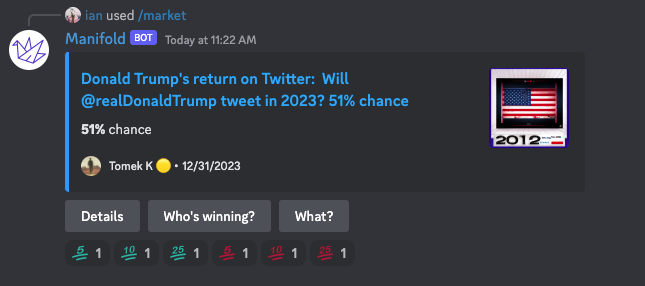

# Manifold Discord Bot
  
Bet directly from your Discord server!
## Adding the bot to your server
All you have to do is visit [this link](https://discord.com/api/oauth2/authorize?client_id=1074829857537663098&permissions=328565385280&scope=bot%20applications.commands) and choose the server you'd like to add the bot to.

## Development
### Setup
- See [creating your bot](https://discordjs.guide/preparations/setting-up-a-bot-application.html#creating-your-bot)
- [Add your bot to your server](https://discordjs.guide/preparations/adding-your-bot-to-servers.html#adding-your-bot-to-servers)
- Set the env variables:
  - `SUPABASE_KEY`, `DISCORD_BOT_TOKEN` (both available in GCP Secret Manager)
- Further reading: [discord.js](https://discordjs.guide)

### Running
`$ yarn dev`
- When developing on your own computer you spin up a discord bot distinct from the active prod one.
- Running `yarn prod` will run the production bot and compete with the remote instance, so shouldn't be used in most cases.

### Deployment  
Deploying to dev isn't supported.  
`$ ./deploy.sh prod`

#### Credits
Thanks to [Arae](https://manifold.markets/a), this is a fork of [mana](https://github.com/AnnikaCodes/mana)
