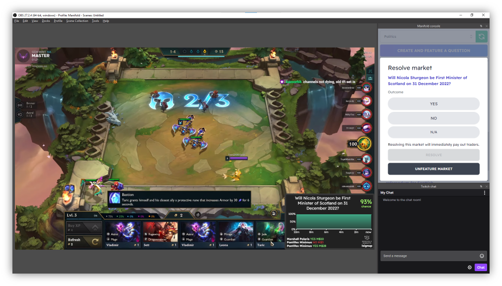

# Manifold Markets Twitch Bot

This repo has everything required to host the Manifold Twitch Bot, and associated overlay and dock browser sources for OBS.

## Environmental variables

This Twitch bot requires the following environmental variables to be defined:

- **PUBLIC_FACING_URL**: The public URL of the host server, without trailing slash, e.g. https://manifold.markets
- **TWITCH_BOT_USERNAME**: The username for the Twitch bot account.
- **TWITCH_BOT_OAUTH_TOKEN**: A valid OAuth token for the Twitch bot account obtained via [this](https://twitchapps.com/tmi) tool.
- **TWITCH_BOT_CLIENT_ID**: The client ID of the Twitch app used to authorize new users. This app can be created in the [Twitch Developer Console](https://dev.twitch.tv/console/app).
- **TWITCH_BOT_CLIENT_SECRET**: The client secret of the Twitch app used to authorize new users.
- **TWITCH_BOT_FIREBASE_KEY**: The API key for the relevant Firebase Firestore. This is currently hardcoded - please ask the author of this repo for the key, or modify the code to point to a new Firestore appropriately.

The following environmental variables are available but optional:

- **PORT**: The port on which the webpages and API are hosted. Default: 9172
- **TARGET**: Represents which Manifold site to target and takes one of the following values (default: LOCAL):
  - PROD (https://manifold.markets/)
  - DEV (https://dev.manifold.markets/)
  - PR_DEV (https://dev-git-twitch-prerelease-mantic.vercel.app/)
  - LOCAL (http://localhost:3000/)
- **DEBUG_TWITCH_ACCOUNT**: The Twitch account to attach to when testing the bot locally. This must be all lowercase.

These can either be defined as global environmental variables on the system, or as a `.env` file in the root of the repository.

## Starting development

- Ensure the [environmental variables](#environmental-variables) are correctly configured
- Ensure [Yarn](https://classic.yarnpkg.com/lang/en/docs/install/#windows-stable) is installed
- Run the following commands from the root of the Manifold repository:
  - `$ yarn`
  - `$ cd twitch-bot`
  - `$ yarn`
  - `$ yarn dev:fullstack`

The server automatically enables debugging in development mode. If using VSCode, you can attach to the process by pressing F5 and launching the `Debug Twitch bot` session.

## Quick deployment to prod or dev servers

In order to deploy to the Manifold Twitch servers, you will need to have the appropriate permissions on your Google account, and the following software installed:

- [NodeJS](https://nodejs.org/en/download/current/) 16 or higher
- [Yarn](https://classic.yarnpkg.com/lang/en/docs/install/#windows-stable)
- [gcloud CLI](https://cloud.google.com/sdk/docs/install) (must be initialized with `gcloud auth login`)
- [Docker](https://docs.docker.com/get-docker/)

If you are using Windows, it is also recommended to have [Git Bash](https://git-scm.com/downloads) installed, as the deployment script is targeted for use on Unix OSs.

Launch `twitch-bot/scripts/deploy-to-remote.sh`. On Windows, this must be done through Git Bash. The script will ask whether you wish to deploy to the development or production server, and should then handle everything else.

The first time this script is run it will need to download docker images, Yarn dependencies and build all the source from scratch, so be patient! Subsequent runs should only take a matter of seconds to complete.

## Alternative deployment

This repo can be built into a Docker image ready for deployment to a hosting site as-is. The container host must have all the [environmental variables](#environmental-variables) set for this to work.

The Docker image can be built with `docker build -t {IMAGE_NAME} .` in the root of the repository, and run with `docker run --env-file .env -p 9172:9172 -it {IMAGE_NAME}`

## Viewing logs in production

There are two ways to view the logs of the deployed bot:

1.  Go to https://console.cloud.google.com/logs/query?project=mantic-markets and select either `bot-DEV` or `bot-PROD` under `Log name`.
2.  SSH into the remote server using `gcloud compute ssh dev-twitch-bot` OR `gcloud compute ssh twitch-bot` and run `docker logs $(docker ps -q) -n 100`

## Viewing usage metrics

- Development: https://dev-twitch-bot.manifold.markets/metrics
- Production: https://twitch-bot.manifold.markets/metrics

## Future development

- [ ] Port the overlay to a [Twitch Extension](https://www.twitch.tv/p/en/extensions/) to decrease viewer latency when viewing bets
- [ ] Support market types other than binary
- [ ] Rate limit management in the Twitch bot to prioritize outgoing messages when there is a risk of Twitch dropping them
- [ ] Support betting to a percentage
- [ ] Save which markets are currently featured on each Twitch channel to Firestore to support server rebooting without interruption
- [ ] Allow docks to set the group within which markets created through chat will be added
- [ ] Support renewing dock and overlay links in case of a leak
